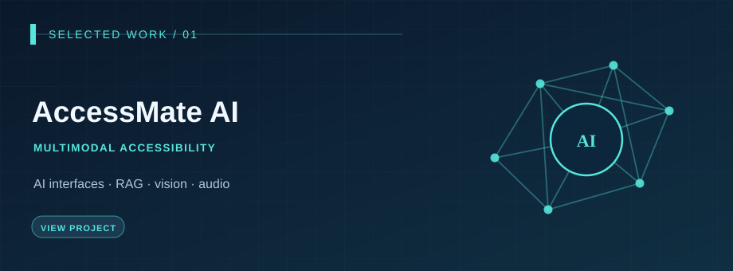
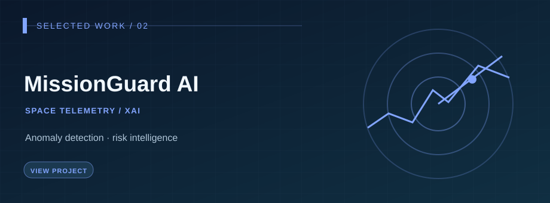
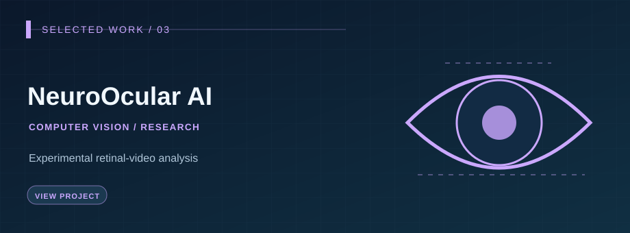
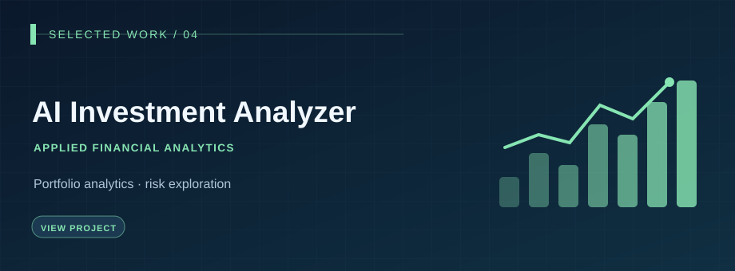
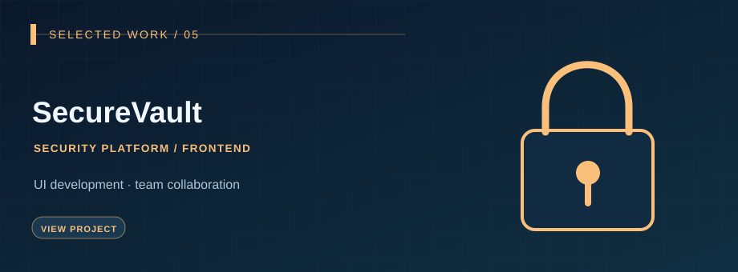
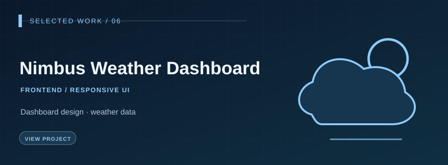

<!-- GitHub Profile README | Self-hosted static SVG covers; no external image services -->

  COMPUTER SCIENCE · AI ENGINEERING · 2026
  <h1>Yousef O. Soliman</h1>
  <h3>AI Engineer · Generative AI · Applied Machine Learning</h3>
  
Building AI applications that connect models, data and software into useful real-world experiences.

  

    <a href="https://www.linkedin.com/in/yousefosalemofficial/"><strong>LinkedIn ↗</strong></a> &nbsp;·&nbsp;
    <a href="https://github.com/yousefosolimanofficial"><strong>GitHub ↗</strong></a> &nbsp;·&nbsp;
    <a href="https://www.hackerrank.com/profile/yousef_0_soliman"><strong>HackerRank ↗</strong></a> &nbsp;·&nbsp;
    <a href="mailto:yousef.osama.ahmed.official@gmail.com"><strong>Email ↗</strong></a>
  

  
<code>Final-year CS · Sinai University</code> &nbsp; <code>AI Engineering internships / graduate roles</code>

---

  <a href="#about"><strong>About</strong></a> &nbsp;·&nbsp;
  <a href="#ai-work"><strong>AI Work</strong></a> &nbsp;·&nbsp;
  <a href="#more-work"><strong>More Projects</strong></a> &nbsp;·&nbsp;
  <a href="#toolkit"><strong>Toolkit</strong></a> &nbsp;·&nbsp;
  <a href="#approach"><strong>Approach</strong></a> &nbsp;·&nbsp;
  <a href="#credentials"><strong>Credentials</strong></a> &nbsp;·&nbsp;
  <a href="#contact"><strong>Contact</strong></a>

---

## 01 / About

I'm a **final-year Computer Science student at Sinai University** specializing in **AI Engineering and Generative AI**. My projects explore the engineering work between an ML model and a usable application: data pipelines, retrieval, model evaluation, APIs, databases and user experiences.

I care about **what a system actually does**, **how its output is evaluated**, and **what its limitations are**. I'm currently pursuing internships and graduate opportunities where I can contribute to applied AI products while learning from experienced teams.

> **Build → Integrate → Evaluate → Improve.** Practical AI, supported by engineering evidence.

---

## 02 / Featured AI Work

> A curated gallery of the projects that best represent my direction. Click any cover to open its repository.

<table>
  <tr>
<td width="50%" valign="top">
   
  <strong>01 / AccessMate AI</strong> 
  FLAGSHIP · MULTIMODAL ACCESSIBILITY
  
Full-stack accessibility application integrating conversational AI, document RAG, OCR/vision, speech and environmental sound awareness.

  
<code>RAG</code> &nbsp; <code>FastAPI</code> &nbsp; <code>React</code> &nbsp; <code>PostgreSQL</code> &nbsp; <code>pgvector</code>

  Started collaboratively; I independently continued, integrated, tested and deployed the final version.  
  <a href="https://github.com/yousefosolimanofficial/Accessmate-Ai-"><strong>Repository / Details ↗</strong></a> &nbsp;·&nbsp; <a href="https://accessmate-ai.duckdns.org"><strong>Project Demo ↗</strong></a>
</td>
<td width="50%" valign="top">
   
  <strong>02 / MissionGuard AI</strong> 
  TEAM PROJECT · ANOMALY DETECTION &amp; XAI
  
Spacecraft telemetry decision-support prototype using ESA OPS-SAT data, hybrid ML, explainable scoring and operator review.

  
<code>Python</code> &nbsp; <code>Scikit-learn</code> &nbsp; <code>Isolation Forest</code> &nbsp; <code>Random Forest</code>

  Collaborative engineering project; individual contributions are described in the repository.  
  <a href="https://github.com/yousefosolimanofficial/MissionGuard-Ai"><strong>Repository / Details ↗</strong></a> &nbsp;·&nbsp; <a href="https://missionguardplatform.duckdns.org"><strong>Project Demo ↗</strong></a>
</td>
  </tr>
  <tr>
<td width="50%" valign="top">
   
  <strong>03 / NeuroOcular AI</strong> 
  RESEARCH PROTOTYPE · COMPUTER VISION
  
Experimental retinal-video analysis and optical-signal processing workflows for neuro-ocular research.

  
<code>Python</code> &nbsp; <code>OpenCV</code> &nbsp; <code>Signal Processing</code> &nbsp; <code>Research</code>

  Exploratory research only. Not clinically validated or intended for diagnosis.  
  <a href="https://github.com/yousefosolimanofficial/NeuroOcular-AI"><strong>Repository / Details ↗</strong></a>
</td>
<td width="50%" valign="top">
   
  <strong>04 / AI Investment Analyzer</strong> 
  APPLIED ANALYTICS · FINANCIAL DATA
  
Interactive portfolio analysis, financial metrics and data-driven risk exploration built around practical decision-support workflows.

  
<code>Python</code> &nbsp; <code>Data Analysis</code> &nbsp; <code>Portfolio Analytics</code>

  Educational/experimental project; not financial advice.  
  <a href="https://github.com/yousefosolimanofficial/Ai-Investment-Analyzer-Project"><strong>Repository / Details ↗</strong></a>
</td>
  </tr>
</table>

---

## 03 / Software Engineering & Other Projects

> Complementary work in frontend engineering, product interfaces and collaborative development.

<table>
  <tr>
<td width="50%" valign="top">
   
  <strong>05 / SecureVault</strong> 
  TEAM PROJECT · FRONTEND DEVELOPMENT
  
Contributed to the frontend and dashboard experience of a collaborative cybersecurity and secure file-management platform.

  
<code>Frontend</code> &nbsp; <code>Dashboard UI</code> &nbsp; <code>Teamwork</code>

  My contribution was on the frontend; backend and security components were developed by teammates.  
  <a href="https://www.linkedin.com/posts/yousefosalemofficial_cybersecurity-informationsecurity-websecurity-ugcPost-7488482118172315649-KWVs/"><strong>Repository / Details ↗</strong></a>
</td>
<td width="50%" valign="top">
   
  <strong>06 / Nimbus Weather Dashboard</strong> 
  SOFTWARE ENGINEERING · RESPONSIVE UI
  
Weather dashboard with current conditions, forecasts, saved cities and responsive interface components.

  
<code>Responsive UI</code> &nbsp; <code>Web Development</code> &nbsp; <code>UI Components</code>

  Supporting project demonstrating application and interface development.  
  <a href="https://github.com/yousefosolimanofficial/Nimbus-Weather-Dashboard"><strong>Repository / Details ↗</strong></a>
</td>
  </tr>
</table>

<a href="https://github.com/yousefosolimanofficial?tab=repositories">Explore all repositories →</a>

---

## 04 / Technical Toolkit

The technologies below reflect tools and concepts explored in my projects—not self-assigned proficiency ratings.

### 04.1 · Languages & Application Development

<code>Python</code> &nbsp; <code>SQL</code> &nbsp; <code>TypeScript</code> &nbsp; <code>React</code> &nbsp; <code>FastAPI</code> &nbsp; <code>Streamlit</code>

### 04.2 · Applied AI & Model Evaluation

<code>Machine Learning</code> &nbsp; <code>Generative AI</code> &nbsp; <code>RAG</code> &nbsp; <code>Scikit-learn</code> &nbsp; <code>OpenCV</code> &nbsp; <code>Model Evaluation</code>

### 04.3 · Data, APIs & Delivery

<code>PostgreSQL</code> &nbsp; <code>pgvector</code> &nbsp; <code>REST APIs</code> &nbsp; <code>Docker</code> &nbsp; <code>Git</code>

---

## 05 / Engineering Approach

| 01 · **DESIGN** | 02 · **EVALUATE** | 03 · **DELIVER** |
| :--- | :--- | :--- |
| Understand the problem, data flow, user requirements and model/application boundaries. | Measure model behavior, examine failure cases, and document meaningful limitations. | Integrate inference with APIs, storage, user interfaces and reproducible workflows. |

**Currently learning:** More rigorous LLM evaluation, robust RAG design, model serving and deployment observability.

---

## 06 / Education & Credentials

### Education

**B.Sc. Computer Science — Sinai University, Egypt**  
Final-year student · Expected graduation: **2026**

### Selected Credentials & Training

- **HackerRank — Python (Basic):** Passed skills assessment (September 2026). [See coding profile ↗](https://www.hackerrank.com/profile/yousef_0_soliman)
- **IBM SkillsBuild — AI Builders Challenge:** Certificate of participation (August 2026; 28 learning hours).
- **InnovEgypt / TIEC:** 45-hour training program with a final startup-project component.

---

## 07 / Opportunities & Contact

I am interested in **AI Engineering**, **Generative AI Engineering**, and **Applied Machine Learning** internships and graduate / entry-level roles. I am open to relevant opportunities in **Egypt, the Gulf region, Europe, and remote teams**, subject to role requirements.

| Channel | Link |
| :--- | :--- |
| LinkedIn | [Connect professionally ↗](https://www.linkedin.com/in/yousefosalemofficial/) |
| GitHub | [Browse the code ↗](https://github.com/yousefosolimanofficial) |
| HackerRank | [Coding profile ↗](https://www.hackerrank.com/profile/yousef_0_soliman) |
| Email | [yousef.osama.ahmed.official@gmail.com](mailto:yousef.osama.ahmed.official@gmail.com) |

---

Designed to be readable. Built around real projects. Static covers are illustrative, not screenshots of the applications.

